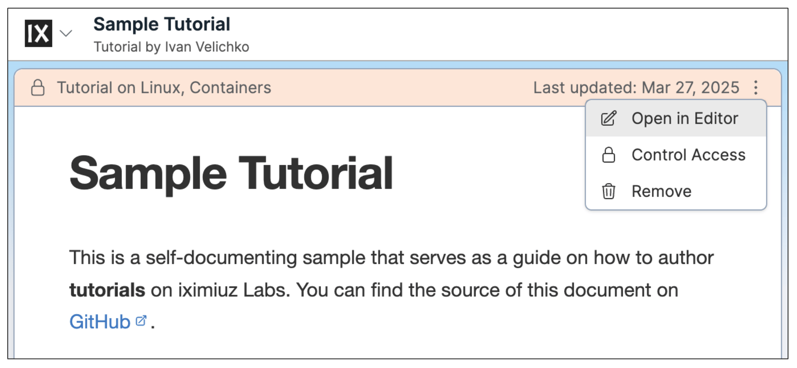
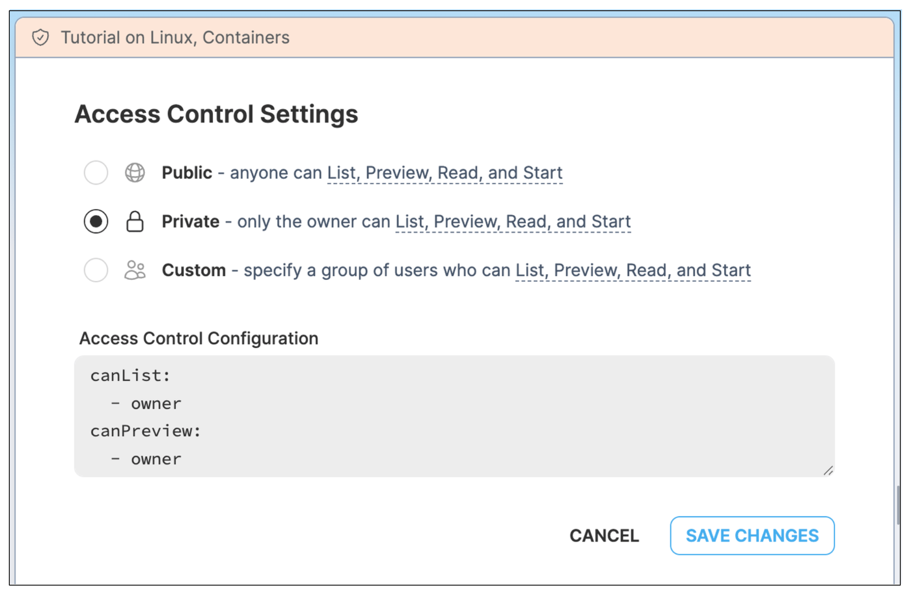

This is a self-documenting sample that serves as a guide on how to author **tutorials** on iximiuz Labs.
You can find the source of this document on [GitHub](https://github.com/iximiuz/labs-content-samples/tree/main/sample-tutorial).
Feel free to use it as a starting point for your own tutorials.


## What is a Tutorial on iximiuz Labs?

Tutorials are deep dives into DevOps and server-side topics where theory blends with hands-on examples.
You can think of them as a **combination of a traditional blog post and a Linux playground**.
A tutorial can be just a few paragraphs long or as large as a book (but in the latter case,
please consider splitting it into multiple tutorials or turning it into a [course](/new/course)).

What makes iximiuz Labs tutorials special:

- Explanatory drawings, screenshots, and diagrams.
- Reproducible shell commands and code snippets.
- Interactive tasks with immediate feedback.
- Ability to access the playground directly from the browser.
- Complementary [challenges](/new/challenge) for more comprehensive learning experience.

Assuming the tutorial is published and accessible (see _access control_ below),
non-authenticated users are typically allowed to read the tutorial's content,
while authenticated users can start the tutorial's playground and mark the tutorial as completed,
with the corresponding progress reflected in their personal dashboard.


## How to Edit the Tutorial

At the moment, iximiuz Labs does not offer a WYSIWYG editor.
Instead, content editing is expected to be done on your local machine,
while the changes are real-time streamed to the page by [`labctl`](https://github.com/iximiuz/labctl),
providing immediate feedback via the traditional _hot-reloading_ experience.

This approach allows you to write content in your favorite markdown editor or even a full-fledged IDE,
keeping the full control over the raw content source and staying out of the way of any AI-powered features of your editor.

::remark-box
---
kind: warning
---

We encourage you to store the source of your tutorials in a git repository,
similarly to how you manage code projects.
This way, you can benefit from the versioning and backup features of git.
::

To get the up-to-date instructions on how to install and use `labctl`,
click "Open in Editor" button in the tutorial's menu:




## How to Control Tutorial Access

Authors can control who can _list_, _preview_, _read_, and _start_ their tutorials.
Every tutorial starts as a **private** draft, meaning only the author can access it.
When the tutorial is ready, the author can choose to make it **public**
(accessible to everyone with the link) or configure _more granular_ access.

The access control settings can be opened from the tutorial's menu:



::remark-box
---
kind: warning
---

While publication via a direct link is always possible,
the iximiuz Labs team reserves the right to choose which tutorials will be listed in the [catalog(s)](/tutorials?filter=community).
**Setting `canList` to `["anyone"]` is treated only as an indicator of the author's willingness to list the tutorial in one of the platform's catalogs.**
Authors can explicitly prohibit listing by setting the `canList` attribute to `["owner"]`.
::


## Tutorial Metadata and Front Matter

Every tutorial is represented by a markdown file that begins with a YAML _front matter_ block.
The smallest possible front matter block for a tutorial should contain the following fields:

```yaml [my-tutorial/index.md]
---
kind: tutorial
title: My Awesome Linux Containers Tutorial
description: |
  A deep dive into managing containers with practical, hands-on examples.

categories:
  - linux
  - containers

tagz:
  - example
  - tutorial-docs

createdAt: 2025-03-26

cover: __stаtic__/cover.png
---
```

The above fields are essential because they feed the platform with information used for indexing, navigation, and displaying your tutorial.
However, iximiuz Labs also supports a number of additional fields that can be used to:

- Specify the tutorial's playground and its customization options.
- Define _init_, _helper_, and _verification_ tasks to be executed on the playground's VMs.
- List accompanying the tutorial _challenges_ to later embed them with the challenge card component.

::details-box
---
:summary: Click here to see the full list of supported Front Matter fields
---

```yaml [my-tutorial/index.md]
---
kind: tutorial         # fixed

title: <string>        # required, 10-120 characters
description: <string>  # required, up to 500 characters

# Up to 2 categories from the closed list:
# - linux
# - networking
# - containers
# - kubernetes
# - programming
# - observability
# - security
# - ci-cd
categories:            # required
  - category-1
  - category-2

# Up to 5 tags, preferably from the already existing ones:
# curl https://labs.iximiuz.com/api/content/tags?kind=tutorial
tagz:                  # required
  - tag-1
  - tag-2

createdAt: <string>    # required, format: YYYY-MM-DD[THH:MM:SS]
updatedAt: <string>    # optional, format: YYYY-MM-DD[THH:MM:SS]

cover: __stаtic__/path/to/cover.png  # required

playground:            # optional
  name: <string>
  machines: ...
  tabs: ...

tasks:                 # optional
  task_name_1:
    ...
  task_name_2:
    ...

challenges:            # optional
  challenge_key_1: {}
  challenge_key_2: {}
---
```
::


## Tutorial Markdown

The _front matter_ section is followed by the markdown content of the tutorial.
All standard markdown elements are supported, including:

- Bold, italic, and underlined text.
- Headings and subheadings.
- Paragraphs, lists, tables, etc.
- Code blocks with optional syntax highlighting.
- Image embedding with the `` syntax.
- Relative and absolute links with the `[text](url)` syntax.

In addition, iximiuz Labs extends standard markdown with rich visual and interactive components (see [MDC](https://nuxt.com/modules/mdc)).

### Content Folder Structure

For convenience, iximiuz Labs allows authors to store any files related to the tutorial in the same directory as the tutorial's markdown file.
Here is a typical folder structure for a tutorial:

```text
my-tutorial/
├── index.md
├── ...other files...
└── __static__/
    ├── cover.png
    └── image.png
```

All files in the `my-tutorial` directory are automatically uploaded to the remote content storage by `labctl`.
This is handy when you need to accompany the tutorial with some helper scripts, internal notes and drafts, etc.

**Files other than the markdown content (i.e., `index.md`) and the static assets sub-folder are not accessible via the API**,
so you are free to store any files in the tutorial's directory that are not intended to be seen by the users.

At the same time, the `__stаtic__` sub-folder is a special folder that is automatically uploaded to the CDN
and can be referenced in the tutorial's markdown using the `__stаtic__` prefix to:

- Embed images (see [How to Embed Images](#how-to-embed-images) below)
- Expose files (e.g., helper scripts) to be downloaded by the playground VMs

**Unlike other files in the tutorial's directory, the `__stаtic__` folder is publicly accessible**,
so you should not put any internal use-only information in it.

::remark-box
---
kind: error
---

### WARNING - UNPROTECTED ASSETS

⚠️&nbsp;&nbsp;Do not put any sensitive information in `__stаtic__` folder&nbsp;&nbsp;️⚠️

While the markdown content of tutorials (or any other forms of content on iximiuz Labs)
is subject to full authorization checks,
the static assets are not. This limitation is due to the extensive
use of CND (e.g., Cloudflare) to deliver static assets with the best
possible performance in all regions of the world.

With some careful URL-construction, files placed in the `__stаtic__`
folder can be fetched via the API by potentially unauthorized users.
This includes anonymous users, bots, and crawlers. The caching duration
of these assets is also very long (up to 1 year).

If you wish to store private files alongside the content, make sure
to place them outside of the `__stаtic__` folder.
::

### How to Embed Images

All images referenced in the tutorial's markdown must be stored in the `__stаtic__` directory next to the `index.md` file,
and their paths in the `src` attributes must be relative and start with `__stаtic__`.
The `labctl content push` command will automatically upload all images from the static directory,
and the relative paths will be substituted with the actual URLs when the tutorial is rendered as a web page.

While the standard markdown syntax for embedding images is supported,
iximiuz Labs also offers two rich MDC components for embedding images.

#### Zoom-able Images with the `image-box` Component

```markdown
::image-box
---
:src: __stаtic__/<image-name>.(png|jpg|...)
:alt: '<short image description>'
:max-width: 1000px # optional
:margin: 0px auto  # optional
:padding: 10px     # optional
:float: left|right # optional
---

_Optional caption goes here._
::
```

Example:

::image-box
---
:src: __static__/docker-run.png
:alt: 'Docker run command under the hood: pulling the image, creating a container, attaching...'
:max-width: 600px
---

_Click on the image to zoom in._
::


#### Slide Show with the `slide-show` Component

```markdown
::slide-show
---
slides:
- image: __stаtic__/<image1>.(png|jpg|...)
  alt: <description of the first image>
- image: __stаtic__/<image2>.(png|jpg|...)
  alt: <description of the second image>
- ...
---
::
```

Example:

::slide-show
---
slides:
- image: __static__/builder-pattern-go.png
  alt: "Builder Pattern for a Go application."
- image: __static__/builder-pattern-nodejs.png
  alt: "Builder Pattern for a Node.js application."
---
::

#### Help! My Images Aren't Updating

Images are cached by the CDN for up to 1 year and the cache key is the image's filename.
This means that if you want to update an image you previously uploaded,
you need to change the filename. You can follow a simple naming convention:

```sh
__stаtic__/image-v1.png
__stаtic__/image-v2.png
...
```

::remark-box
---
kind: warning
---

With the above naming convention, you'll also need to update the markdown references(s) to the image
every time you upload a new version of the image file.
::


### How to Embed Code Snippets

Inline code elements and code blocks are supported with the standard single- and triple-backtick syntax.
For code blocks, you can optionally specify the language to enable syntax highlighting,
add a (file)name to display in the code block, and highlight specific lines.

Look up the below code snippet in the source of this tutorial on [GitHub](https://github.com/iximiuz/labs-content-samples/blob/main/sample-tutorial/index.md) to see how it's done:

```yaml [~/my/file.yaml]{2,9-11}
apiVersion: apps/v1
kind: Deployment # highlighted line
metadata:
  name: my-app
  namespace: default
  labels:
    app: my-app
spec:
  replicas: 3 # highlighted block
  selector:
    matchLabels:
      app: my-app
```

### How to Embed Tabbed Code Blocks

iximiuz Labs supports tabbed code blocks with the `tabbed` MDC component:

```markdown
::tabbed
---
tabs:
  - name: tab1
    title: Tab 1
  - name: tab2
    title: Tab 2
---
#tab1
...markdown...

#tab2
...markdown...
::
```

::remark-box

The content of each tab is regular markdown and can include any elements supported by the markdown syntax,
including other rich MDC components.
::

Here is an example of a tabbed code block:

::tabbed
---
tabs:
  - name: golang
    title: Go
  - name: python
    title: Python
  - name: javascript
    title: JavaScript
---
#golang
```go
package main

func main() {
    fmt.Println("Hello, World!")
}
```

#python
```python
print("Hello, World!")
```

#javascript
```javascript
console.log("Hello, World!");
```
::

All tabbed blocks in the document are synchronized, so if the user switches to another code tab in one block,
the same tab will be selected in all other tabbed blocks on the page:

::tabbed
---
tabs:
  - name: golang
    title: Go
  - name: python
    title: Python
  - name: javascript
    title: JavaScript
---
#golang
```go
package main

func main() {
    fmt.Println("Multiple tabbed sections are supported!")
}
```

::remark-box
---
kind: warning
---
This is a warning remark box inside a tabbed block.
::

#python
```python
print("Multiple tabbed sections are supported!")
```

- This is
- ...a list

#javascript
```javascript
console.log("Multiple tabbed sections are supported!");
```
::

### How to Embed Visual Boxes for Notes, Details, and Hints

When information doesn't belong to the main flow of the tutorial, but it's still important to mention,
you can use one of the following visual boxes:

#### Remark Box

Used to highlight side notes, warnings, or error messages.
The minimal syntax for a remark box is as follows:

```markdown
::remark-box
<side note text goes here>
::
```

In the full form, you can also specify the kind of the remark box:

```markdown
::remark-box
---
kind: info|warning|error
---

<side note text goes here>
::
```

Examples:

::remark-box
💡 This is an info remark box. The emoji is chosen arbitrarily.
::

::remark-box
---
kind: warning
---

⚠️ This is a warning remark box. The emoji is chosen arbitrarily.
::

::remark-box
---
kind: error
---

❌ This is an error remark box. The emoji is chosen arbitrarily.
::

#### Details Box

A collapsible section for additional details, code snippets, or extended explanations.

```markdown
::details-box
---
:summary: <summary text goes here>
---

<the collapsible section's content goes here>
::
```

The content can be as long as needed and use all the supported markdown elements, except for nested details-boxes.

Example:

::details-box
---
:summary: Click here to expand/collapse the section
---

The collapsible section's content goes here.

::remark-box
---
kind: warning
---

This is a warning remark box inside a details-box 🤯
::

Code blocks are also supported inside details-boxes:

```python
def hello():
    print("Hello, world!")
```
::

#### Hint Box

Very similar to the `details-box` component, but styled slightly differently and carries different semantics.

```markdown
::hint-box
---
:summary: Hint <number>
---

<hint text goes here>
::
```

Example:

::hint-box
---
:summary: Hint 1
---

Try running `docker run --help` to see available flags for running containers in detached mode.
::

### How to Embed Challenges

A _challenge card_ is a rich link to the corresponding challenge that shows a preview of the challenge,
some metadata, and a button to start the challenge.
Authors can embed any challenges listed in the public [challenges catalog](/challenges) or prepare their own [challenges](/new/challenge).

Challenges are embedded into the tutorial using the `card-challenge` component with the corresponding challenge ~~name~~ key:

```markdown
::card-challenge
---
# challenges is an object in the tutorial's front matter
:challenge: challenges.<challenge_key>
---
::
```

**Before embedding a challenge, you must list it in the tutorial's Front Matter:**

```yaml
---
kind: tutorial
title: ...

challenges:
  <challenge_key_1>: {}
  <challenge_key_2>: {}
---
```

Examples:

::card-challenge
---
:challenge: challenges.docker_101_container_run
---
::

::card-challenge
---
:challenge: challenges.kubernetes_pod_with_faulty_init_sequence
---
::

::remark-box

To get a challenge key, take the challenge name (the last segment of the challenge's URL) and replace all `-` with `_`.
The substitution is needed because `challenges` in the front matter is an object,
so having a dash in the challenge name would break the object key syntax.

Example:

```
# Challenge URL
https://labs.iximiuz.com/challenges/docker-101-container-run

# Challenge name
docker-101-container-run

# Challenge key
docker_101_container_run
```
::


## Adding a Playground to the Tutorial

With every tutorial, you have the option to attach a remote playground -
allowing users to run commands in a browser-based or SSH-accessible environment.
To attach a playground to a tutorial, specify the playground name in the tutorial's Front Matter as follows:

```yaml
---
kind: tutorial
title: ...

playground:
  name: <playground-name>
---
```

You can choose any iximiuz Labs playground (an [official "base" playground](/playgrounds?filter=base), any of the [community-maintained playgrounds](/playgrounds?filter=community), or [your own custom playground](/playgrounds?filter=authored)) and optionally tweak it further by overriding the playground's `machines`, and `tabs` attributes in the tutorial's Front Matter.

Click [here](/playgrounds?filter=all) to see a full list of available playgrounds or run the following command:

```sh
curl -s https://labs.iximiuz.com/api/playgrounds?filter=all \
  | jq -r '.[] | .name + " - " + .description'
```

::remark-box
---
kind: warning
---

⚠️ The playground you choose is subject to its own access control and usage limits.
Make sure that it's at least as permissive as the corresponding tutorial's access control policy.
For instance, if the tutorial is publicly accessible, but the playground is private or restricted,
the users will not be able to start the tutorial.
::

While a tutorial can be created without a playground,
it is highly recommended to attach one to enhance the learning experience.
This gives users an interactive environment to execute commands and follow along with the tutorial's practical exercises.

::remark-box
---
kind: warning
---

⚠️ Only tutorials with playgrounds can be **started** and **completed** by iximiuz Labs users.
::

### Customizing Playground Machines

By default, the tutorial will use all the machines defined in the playground's configuration.
If you need to alter the set of machines or customize their behavior,
you can define a `machines` attribute within the `playground` section of the tutorial's Front Matter.

::remark-box

💡 For compatibility reasons, the machine sets of "base" playgrounds are _frozen_.
This includes the hostnames, so you can rely on them in your tutorial markdown and scripts.
To get a list of available machines in a playground, use the following command:

```sh
curl -s https://labs.iximiuz.com/api/playgrounds/<name> \
  | jq -r '.machines[] | .name'
```
::

::remark-box
---
kind: warning
---

⚠️ While machine hostnames are frozen, **no guarantees are made about the machine's IP addresses
and the number of network interfaces per machine**. The only future-proof way to access a machine
over the network is via its hostname - e.g., `ping cplane-01`.
::

The following customization options are available:

- Using only a subset of machines.
- Reducing machine's system resources.
- Changing machine's default user.
- Changing user's welcome message.
- Disabling SSH access to a machine.

For example, here is how the playground of the current tutorial was customized:

```yaml
playground:
  name: k3s

  # List available machines. By default, all playground machines are available,
  # but once you define the `machines` attribute, only the explicitly listed
  # subset of machines will be added to the playground.
  machines:
  - name: dev-machine
    # Override default resources (cannot be above the limits of the playground)
    resources:
      cpuCount: 1
      ramSize: "1Gi"
    # users: ...
    # noSSH: ...

  - name: cplane-01
    # Override the default login user and set a custom welcome message.
    users:
    - name: root
      default: true
      # Use a special value '-' to disable the welcome message completely.
      welcome: Welcome to the control plane node.

  - name: node-01
    # Include machine in the playground but disable SSH access to it
    # (automatically disables the terminal UI tab).
    noSSH: true

  # This machine is intentionally not listed, meaning that it won't be available
  # in the content's playground (even though it's part of the base playground).
  # - name: node-02
```

### Controlling UI Tabs

By default, every machine in the playground is allocated a `terminal` tab in the UI.
However, authors can customize which tabs are visible.
Beyond the `terminal`, the following types of tabs are available:

- **IDE** (`kind: ide`): A built-in online IDE for coding environments (powered by [coder/code-server](https://github.com/coder/code-server)).
- **Kubernetes Visual Explorer** (`kind: kexp`): A visual explorer for Kubernetes-specific tutorials (powered by [iximiuz/kexp](https://github.com/iximiuz/kexp)).
- **HTTP(s) Port** (`kind: http-port`): To access web applications such as Kubernetes Dashboard, Grafana, or Prometheus UI running in the playground.
- **Web Page** (`kind: web-page`): To embed an external webpage (e.g., an official Kubernetes documentation page) directly within the tutorial.

Once you define the `tabs` attribute, the explicitly listed set of tabs will be used instead of the default ones.

For example, here is how the tabs of the current tutorial are defined:

```yaml
kind: tutorial
title: ...

playground:
  name: k3s

  tabs:
  - kind: ide            # enable the online IDE (code-server)
  - kind: kexp           # enable the Kubernetes Visualizer (kexp)

  - machine: dev-machine # 'dev-machine' and 'cplane-01' are hostnames
  - machine: cplane-01   # 'kind: terminal' is implied

  - kind: http-port      # expose a web app listening on machine's port as an iframe tab
    name: Nginx          # user-defined name of the tab
    number: 30080        # port number to expose
    machine: node-01     # machine to expose the port on
    # tls: true          # enable TLS if the target service uses HTTPS

  - kind: web-page       # embed an external web page as an iframe tab
    name: example.com    # user-defined name of the tab
    url: https://example.com
```

### Interacting with Tabs from Markdown

You can **activate a certain tab (by its ID, name, or machine) from the markdown** using the `tab-locator-inline` component.
Here is an example:

```markdown
Run this command from the :tab-locator-inline{text='dev-machine' machine='dev-machine'}:

...

Then, switch to the :tab-locator-inline{text='IDE' name='IDE'}...
```

And here is how it looks when rendered:
Run this command from the :tab-locator-inline{text='dev-machine' machine='dev-machine'}...
Then, switch to the :tab-locator-inline{text='IDE' name='IDE'}...

It is also possible to **create new tabs dynamically**, but at the moment, only `terminal` tabs are supported:

```markdown
Run this command from a :tab-locator-inline{text='new terminal' machine='cplane-01' :new=true}...
```

Here is how it looks when rendered:
Run this command from a :tab-locator-inline{text='new terminal' machine='cplane-01' :new=true}...

### Playground Container Registry

Each playground has a private container registry that is used to store images for the tutorial.
It's a handy way to transfer images between playground VMs, or from a playground VM into a Kubernetes cluster deployed in the playground.

::image-box
---
:src: __static__/mini-lan.png
:alt: 'A multi-node playground example: 4 VMs and 1 ephemeral container registry sitting in the same LAN.'
:max-width: 600px
---

_A multi-node playground example: 4 VMs and 1 ephemeral container registry sitting in the same LAN._
::

You can access the registry from any machine in the playgrounds using the following address:

```
registry.iximiuz.com
```

By default, the registry allows anonymous access.
To restrict access, you can specify a username and password:

```yaml
playground:
  name: ...
  registryAuth: <username>:<password>
```

::remark-box
💡 Since the registry is available only from the playgrounds,
protecting it with a username and password is not required for most tutorials.
::


## Background Tasks

One of the most powerful features of iximiuz Labs is its **task execution engine**.
Each machine in the playground can run three types of tasks:

- `init`: runs during playground initialization and has no UI representation except for the initial loading screen.
- `helper`: similar to `init`, but doesn't block the playground from starting and can be used during the whole playground's lifetime.
- `regular`: the only user-facing type of tasks that are used to verify specific system conditions and/or accept user input.

Tasks in iximiuz Labs are used to:

- Run scripts to customize the playground's environment.
- Provide dynamic feedback as users follow along the learning material.
- Interact with the user and check that certain actions are performed correctly.

This sample tutorial demonstrates how to use all three types of tasks.
Refer to the [source of this tutorial on GitHub](https://github.com/iximiuz/labs-content-samples/blob/main/sample-tutorial/index.md)
to see how the tasks are defined in the tutorial's Front Matter.

### Initialization Task

An `init` task runs during playground initialization (before the UI is fully available).
It's vital for setting up the environment but is not reflected in the user interface.
For example:

```yaml
---
kind: tutorial
title: ...

playground:
  name: ...

tasks:
  init_deploy_nginx:
    # Init tasks are used to finalize the setup of the playground.
    # Until all init tasks are completed, the playground screen shows
    # a loading animation.
    init: true

    # By default, the task is executed on every machine of the playground.
    # If the task needs to be executed only on a specific machine, you
    # can specify it with the `machine` property. Beware, at the moment,
    # either none or all tasks must have the `machine` property (in the latter case,
    # different tasks may be executed on different machines).
    machine: dev-machine

    # By default, tasks are executed as the `root` user.
    # If the task needs to be executed as a different user, you
    # can specify it with the `user` property.
    user: laborant

    run: |
      kubectl run nginx-01 --image=ghcr.io/iximiuz/labs/nginx:alpine --port=80
```

### Regular Verification Task

Definition of a regular task in the Front Matter is identical to that of an init task (except for the `init: true` part).
However, regular tasks also have a corresponding markdown representation via a `simple-task` component:

```markdown
::simple-task
---
:tasks: tasks
:name: <task-name>
---
#active
<what needs to be done / what system condition needs to be met>

#completed
<what has been done or any other confirmation of completion>
::
```

The `simple-task` component provides a visual representation of the task's progress and _dynamic hints_ (if any).
Here's how it looks:

::simple-task
---
:tasks: tasks
:name: verify_file_exists
---
#active
Waiting for `/tmp/some/file.txt` to be created...

#completed
Nailed it! The file has appeared 🎉
::

The above component is bound to the following task definition in the Front Matter (via the `name` property):

```yaml
tasks:
  # Regular tasks are used to check if certain system conditions are met
  # and/or requested user actions are completed. Each regular task should
  # have a visual representation in the content's body, and the total/done
  # number of regular tasks is displayed in the content's header, serving
  # as a main content completion indicator.
  verify_file_exists:
    machine: dev-machine
    # The only mandatory property of a regular task is the `run` script.
    # The task will be executed in a loop until it exits with 0.
    run: |
      if [ ! -f /tmp/some/file.txt ]; then
        echo "This is a diagnostic message. The user won't see it, but it's helpful for debugging."
        exit 1
      fi
```

Try making the task to pass by executing the following command:

```sh
mkdir -p /tmp/some && echo "Hello, world!" > /tmp/some/file.txt
```

::remark-box
💡 Make sure you're executing the command from the `dev-machine` (and not any other machine in the playground).
::

### User-Input Task

A _user-input_ task is an alternative way to visualize a regular task.
It is used when the task requires the user to submit specific data (for example, reading a value from a log).
The input is validated, and if correct, it's passed to the corresponding task for further processing:

```markdown
::user-input-task
---
:tasks: tasks
:name: <task-name>
:validate: <simple shell command or pipeline>
:destination: <path to a file to store the input>
---
#active
<what needs to be entered by the user>

#completed
<confirmation of completion>
::
```

Here's an example of a user-input task UI element:

```markdown
::user-input-task
---
:tasks: tasks
:name: input_container_name
:validate: 'echo "x(.input)" | grep "[0-9a-f-]\{2,16\}"'
:destination: /tmp/container-name.txt
---
#active
Enter the name of the future container:

#completed
Nice one! You certainly have a good taste in names 🎉
::
```

::user-input-task
---
:tasks: tasks
:name: input_container_name
:validate: 'echo "x(.input)" | grep "[0-9a-f-]\{2,16\}"'
:destination: /tmp/container-name.txt
---
#active
Enter the name of the future container:

#completed
Nice one! You certainly have a good taste in names 🎉
::

Under the hood, the above `user-input-task` component is bound to the another _regular_ task from the tutorial's Front Matter:

```yaml
tasks:
  ...
  # Tasks can also be used to collect user input. While it's up to the task's
  # author to decide what to do with the input, the input is usually done via
  # some well-known file (the task's UI element and the task's `run` script
  # should agree on the file name beforehand).
  # The task's `run` script can do anything with the provided user input.
  input_container_name:
    machine: dev-machine
    # This task just echoes the user input (but usually, you'd want to assert
    # something about the input).
    run: |
      cat /tmp/container-name.txt
```

Submit any valid container name to see the task to pass.

### Task Dependencies

Tasks can depend on each other.
For example, the following task depends on the `input_container_name` task:

```yaml
tasks:
  ...
  verify_container_is_running:
    machine: dev-machine
    # Regular tasks run only after all init tasks are completed.
    # By default, regular tasks run in parallel but the execution order
    # can be controlled with the `needs` property.
    needs:
      - input_container_name
    env:
      # A handy way to pass the output of a previous task to the current one
      # is to use the a template variable x(.needs.task_name.stdout|stderr).
      # This example illustrates how to pass the output of the `input_container_name`
      # task to the `verify_container_is_running` task.
      - CONTAINER_NAME=x(.needs.input_container_name.stdout)
    # The task engine also defines a number of higher-level helper functions
    # that can be used in the `run` script. For example, `docker_container_is_running`
    # is a helper function that checks if a container is running.
    run: |
      if ! docker_container_is_running ${CONTAINER_NAME}; then
        echo "The container isn't running."
        exit 1
      fi
```

Notice how the `needs` property is used to control the order of task execution
and to access the output of (one of) the previous task(s) if needed.

Make the below task to pass by running the following command:

```sh
docker run -d --name NAME nginx:alpine
```

::simple-task
---
:tasks: tasks
:name: verify_container_is_running
---
#active
Waiting for the container to be running...

#completed
Congratulations! The container is running 🎉
::

::details-box
---
:summary: 'List of Built-in Helper Functions'
---

The task engine defines a number of built-in helper functions that can be used in the `run` script:

```sh
#!/usr/bin/env bash

###############################################################################
# Docker
###############################################################################
docker_container_name() {
  docker container inspect --format '{{.Name}}' "$@"
}

docker_container_pid() {
  docker container inspect --format '{{.State.Pid}}' "$@"
}

docker_container_ip() {
  docker container inspect --format '{{.NetworkSettings.IPAddress}}' "$@"
}

docker_container_image() {
  docker container inspect --format '{{.Config.Image}}' "$@"
}

docker_container_image_id() {
  docker container inspect --format '{{.Image}}' "$@"
}

docker_container_is_running() {
  [ "$(docker container inspect --format '{{.State.Running}}' $@ 2>/dev/null)" = "true" ]
}

docker_container_exit_code() {
  docker container inspect --format '{{.State.ExitCode}}' $@
}

docker_container_count_total() {
  docker ps -aq | wc -l
}

docker_container_count_running() {
  docker ps -q | wc -l
}

docker_image_id() {
  docker image inspect --format '{{.Id}}' "$@"
}

docker_image_size_bytes() {
  docker image inspect --format '{{.Size}}' "$@"
}

###############################################################################
# Podman
###############################################################################
podman_container_name() {
  sudo podman inspect --format '{{.Name}}' "$@"
}

podman_container_pid() {
  sudo podman inspect --format '{{.State.Pid}}' "$@"
}

podman_container_ip() {
  sudo podman inspect --format '{{.NetworkSettings.IPAddress}}' "$@"
}

podman_container_is_running() {
  [ "$(sudo podman inspect --format '{{.State.Running}}' $@ 2>/dev/null)" = "true" ]
}

podman_container_exit_code() {
  sudo podman inspect --format '{{.State.ExitCode}}' $@
}

podman_container_count_total() {
  sudo podman ps -aq | wc -l
}

podman_container_count_running() {
  sudo podman ps -q | wc -l
}

###############################################################################
# nerdctl
###############################################################################
nerdctl_container_name() {
  sudo nerdctl inspect --format '{{.Name}}' "$@"
}

nerdctl_container_pid() {
  sudo nerdctl inspect --format '{{.State.Pid}}' "$@"
}

nerdctl_container_ip() {
  sudo nerdctl inspect --format '{{.NetworkSettings.IPAddress}}' "$@"
}

nerdctl_container_is_running() {
  [ "$(sudo nerdctl inspect --format '{{.State.Running}}' $@ 2>/dev/null)" = "true" ]
}

nerdctl_container_exit_code() {
  sudo nerdctl inspect --format '{{.State.ExitCode}}' $@
}

nerdctl_container_count_total() {
  sudo nerdctl ps -aq | wc -l
}

nerdctl_container_count_running() {
  sudo nerdctl ps -q | wc -l
}

###############################################################################
# ctr
###############################################################################
ctr_container_netns() {
  sudo lsns -p $(ctr_container_pid $@) -t net --nowrap --noheadings | awk '{print $1}'
}

ctr_container_pid() {
  sudo ctr tasks ps "$@" | head -n 2 | tail -n 1 | awk '{print $1}'
}

ctr_container_is_running() {
  sudo ctr tasks list | grep RUNNING | grep -F "$@" >/dev/null
}

ctr_container_count_total() {
  sudo ctr containers list -q | wc -l
}

ctr_container_count_running() {
  sudo ctr tasks list | grep RUNNING | wc -l
}
```

You can register your own helper functions by creating shell scripts in the following location:

```sh
/opt/iximiuz-labs/examiner/checks.d
```
::

### Dynamic Hints and Failure Conditions

Sometimes, you may want to provide a hint to the user that depends on their actions in the playground.
It can be done by defining a `hintcheck` script for the task.
The content of the `hintcheck` script stdout and stderr will be displayed in the corresponding `simple-task` UI element as a so called _dynamic hint_.

Here is an example:

```yaml
tasks:
  ...
  # Ready tasks are executed in a loop until they either complete (exit with 0)
  # or fail (exiting with a non-zero code doesn't mean failure, see failcheck for
  # details). There is a small delay between consecutive executions of the task
  # (currently 1 second, but it's subject to change).
  verify_container_is_stopped:
    machine: dev-machine
    needs:
      - input_container_name
      - verify_container_is_running
    env:
      - CONTAINER_NAME=x(.needs.input_container_name.stdout)
    run: |
      if docker_container_is_running ${CONTAINER_NAME}; then
        echo "The container is still running."
        exit 1
      fi

      if ! docker ps -a | grep -q ${CONTAINER_NAME}; then
        echo "The container is completely gone."
        exit 1
      fi

    # Hintcheck is an optional run-like script that is executed after
    # the task's `run` script. The exit code of the hintcheck script
    # has no effect on the task's outcome. Any output of the hintcheck
    # script (stdout and stderr) gets showed in the task's UI element as
    # a dynamic hint.
    hintcheck: |
      if docker_container_is_running ${CONTAINER_NAME}; then
        echo "The container is still running."
        echo "Run 'docker stop ${CONTAINER_NAME}' to stop it."
      fi

    # Failcheck is an optional run-like script that is executed before
    # the task's `run` instructions to validate that some critical
    # (playground-wide) conditions are still met. If the failcheck exits
    # with a non-zero exit code, the task is considered failed, and the whole
    # playground transitively is marked as failed, too (i.e., the user will
    # have to restart the current content attempt).
    failcheck: |
      if ! docker ps -a | grep -q ${CONTAINER_NAME}; then
        echo "The container has been removed. You shouldn't have done that!"
        echo "Please, restart the tutorial and try again."
        exit 1
      fi
```

Another handy feature of the task engine is the ability to define a _failure condition_ for a task.
It can be done by defining a `failcheck` script for the task.
The content of the `failcheck` script stdout and stderr will also be displayed in the corresponding `simple-task` UI element,
but, unlike the `hintcheck`, if the `failcheck` scripts exits with a non-zero exit code, the whole playground will be marked as failed,
and the user will have to restart the content attempt.

Here is an example:

::simple-task
---
:tasks: tasks
:name: verify_container_is_stopped
---
#active
Waiting for the container to be stopped...

#completed
Nailed it! The container is stopped 🎉
::

Try failing the task by running the following command:

```sh
docker rm -f NAME
```

### Debugging Tasks

Oftentimes, tasks' scripts should be kept secret from the users as they can provide excessive details about the expected user actions
(might be less important for Tutorials, but is crucial for Challenges, where the users are expected to come up with the right commands on their own).

Tasks are executed by a daemon process called `examinerd`, which runs on each machine in the playground.
By default, this daemon hides all the stdout and the stderr output of the tasks' scripts.
However, content authors can access the output of all tasks by either using the `examinerctl` CLI tool or the _Tasks Dev Tools_ UI element.

::image-box
---
:src: __static__/tasks-dev-tools.png
:alt: 'Tasks Dev Tools UI (available only to content authors).'
:max-width: 800px
---

_Tasks Dev Tools UI (available only to content authors)._
::

To activate the Tasks Dev Tools, find the `Tasks` button in the bottom-right corner of the playground and click on it.


## Instead of Conclusion

Remember:

- **Titles are 80% of success** - take your time to craft a good one.
- **Keep it short and concise** - avoid fluff and keep the text to the point.
- **Use concrete words and provide examples** - they make the tutorial testifiable (and falsifiable).
- **Use bullet points and lists** - they make the text more readable and engaging.
- **Use (lots of) images** - a picture is indeed worth a thousand words.
- [**Explain what you're going to explain, how, and why**](https://lucasfcosta.com/2021/09/30/explaining-in-writing.html) - this pattern works so well!
- [**Beware of the "But & Therefore rule"**](https://nathanbweller.com/creators-of-south-park-storytelling-advice-but-therefore-rule/) - it works even for technical writing.


Happy authoring!
